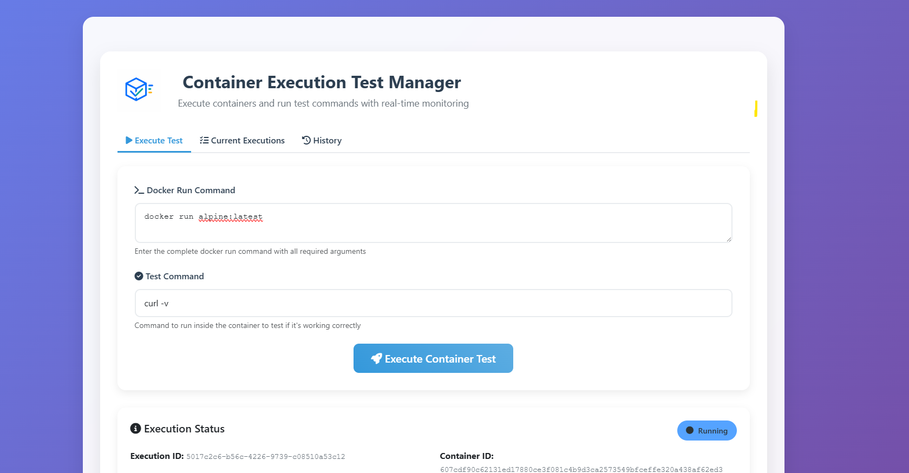
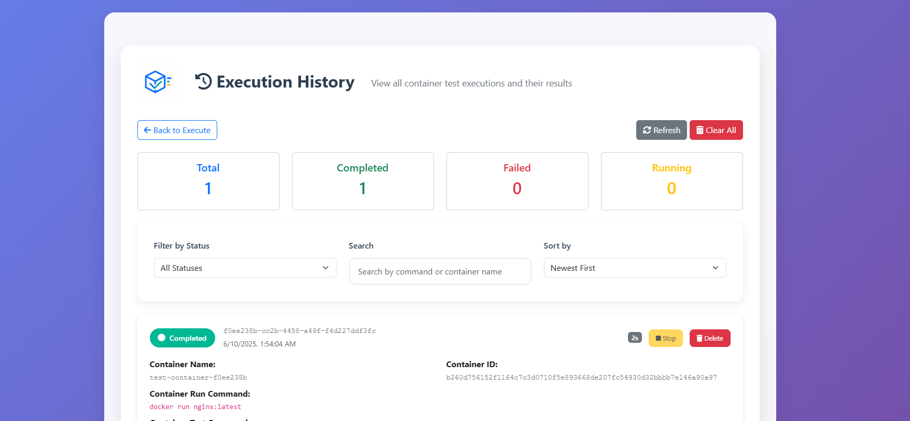

#  Container Executions Manager

  <p style="margin: 0; font-size: 1rem;">
    <span style="float: left; font-size: 2.5rem; line-height: 1; padding-right: 0.3rem;">A</span>n application for testing Docker/Podman containers. This application provides a web interface to run containers and execute test commands within them.
    It also stores a history of all executed container run commands and a few metrics regarding each run, i.e., how long the container ran, what was the output of the command executed within the container, etc.
  </p>
  
---
## Screenshots

### Main Interface
<p align="center">
  
</p>

### Execution History
<p align="center">
  
</p>

---

## Table of Contents
- [Features](#features)
- [Prerequisites](#prerequisites)
- [Installation](#installation)
- [Usage](#usage)
  - [Running as a Development Server](#running-as-a-development-server)
  - [Running as a Systemd Service](#running-as-a-systemd-service)
- [Container Tool Selection](#container-tool-slection)
- [Docker Setup](#docker-setup)
  - [Security Considerations](#security-considerations)
  - [Alternative: Using Podman](#alternative-using-podman)
- [API Endpoints](#api-endpoints)
- [Web Interface](#web-interface)
- [Development](#development)
  - [Project Structure](#project-structure)
  - [Adding New Features](#adding-new-features)
- [License](#license)

## Features
- Run Docker or Podman containers with custom commands
- Execute test commands inside running containers
- Monitor container status and test results
- View execution history
- Stop running containers
- Support for both Docker and Podman backends

## Prerequisites
- Python 3.8 or higher
- Docker or Podman installed on the system
- Systemd (for running as a service)

## Installation
1. **Clone the repository:**
   ```bash
   git clone https://github.com/kognitionlab/container-ex
   cd container-ex
   ```
2. **Create and activate a virtual environment:**
   ```bash
   python -m venv venv
   source venv/bin/activate  # On Windows: venv\Scripts\activate
   ```
3. **Install dependencies:**
   ```bash
   pip install -r requirements.txt
   ```

## Usage

### Running as a Development Server
1. **Run with Docker backend (default):**
   ```bash
   python run.py
   ```
2. **Run with Podman backend:**
   ```bash
   python run.py --backend podman
   ```

### Running as a Systemd Service
1. **Edit the service file:**
   ```bash
   cp container-ex.service /tmp/container-ex.service
   nano /tmp/container-ex.service
   ```
   Update the following variables in the service file:
   - `User`: Your system username
   - `Group`: Your system group
   - `WorkingDirectory`: Full path to the application directory
     
2. **Install the service:**
   ```bash
   sudo mv /tmp/container-ex.service /etc/systemd/system/
   sudo systemctl daemon-reload
   sudo systemctl enable container-ex
   sudo systemctl start container-ex.service
   ```
3. **Verify the service:**
   ```bash
   sudo systemctl status container-ex.service
   sudo journalctl -u container-ex.service -f
   ```
4. **Service management commands:**
   ```bash
   sudo systemctl stop container-ex.service
   sudo systemctl restart container-ex.service
   sudo systemctl disable container-ex.service
   ```
5. **Troubleshooting:**
   ```bash
   sudo systemctl is-active container-ex.service
   sudo journalctl -u container-ex.service -n 50 --no-pager
   sudo systemctl cat container-ex.service
   ```

### Container Tool Selection
The application supports two container backends:
- Docker (default)
- Podman

Select the backend using the `--backend` flag when running the application or by setting the `BACKEND` environment variable in the systemd service file.

## Docker Setup
To run the application using Docker, you'll need to mount the Docker socket to allow the container to communicate with the host's Docker daemon:

```bash
# Build the image
docker build -t container-ex .

# Run the container with Docker socket mounted
docker run -d \
  --name container-ex \
  -p 5000:5000 \
  -v /var/run/docker.sock:/var/run/docker.sock \
  container-ex
```

### Security Considerations
When mounting the Docker socket, be aware of the following security implications:
1. The container will have access to the host's Docker daemon
2. This means it can create, modify, and delete containers on the host
3. It's recommended to:
   - Run the container with a non-root user (already configured in the Dockerfile)
   - Use Docker's security features like seccomp profiles
   - Consider using Docker's rootless mode
   - Implement proper access controls in your application

### Alternative: Using Podman
If you prefer not to mount the Docker socket, you can use Podman instead:

```bash
# Install Podman
sudo apt-get install -y podman

# Run with Podman
podman run -d \
  --name container-test-manager \
  -p 5000:5000 \
  container-test-manager
```

## API Endpoints
- `POST /api/execute`: Execute a container and test command
  - Required fields: `docker_command`, `test_command`
  - Optional fields: `backend` (docker/podman)
- `GET /api/status/<execution_id>`: Get execution status
- `GET /api/executions`: Get all executions
- `DELETE /api/executions/<execution_id>`: Delete an execution
- `POST /api/containers/<container_id>/stop`: Stop a running container

## Web Interface
- `/`: Main page with container execution form
- `/history`: History page showing all executions

## Development

### Project Structure
```text
app/
├── __init__.py           # Application factory
├── api/
│   └── routes.py        # API routes
├── models/
│   └── container.py     # Data models
├── services/
│   ├── container_manager.py    # Container management
│   ├── container_executor.py   # Container execution
│   └── container_backend.py    # Backend abstraction
├── templates/           # HTML templates
└── utils/
    └── serialization.py # Serialization utilities
run.py                  # Application entry point
```

### Adding New Features
1. Create new models in `app/models/`
2. Add new services in `app/services/`
3. Add new routes in `app/api/routes.py`
4. Add new templates in `app/templates/`

## License
Apache 2.0
