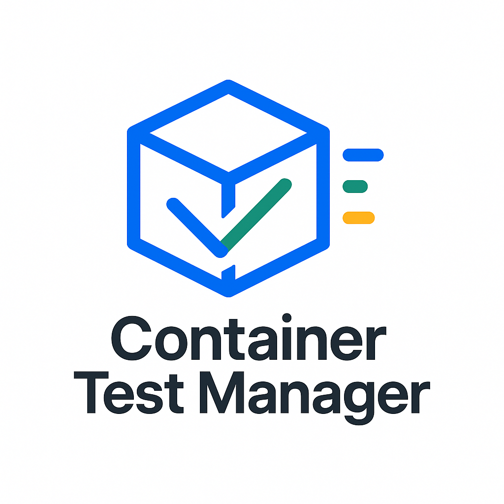

# Container Test Manager



A Flask web application for managing and testing Docker/Podman containers. This application provides a web interface to run containers and execute test commands within them.

## Features

- Run Docker or Podman containers with custom commands
- Execute test commands inside running containers
- Monitor container status and test results
- View execution history
- Stop running containers
- Support for both Docker and Podman backends

## Prerequisites

- Python 3.8 or higher
- Docker or Podman installed on the system
- Systemd (for running as a service)

## Installation

1. Clone the repository:
```bash
git clone <repository-url>
cd container-ex
```

2. Create and activate a virtual environment:
```bash
python -m venv venv
source venv/bin/activate  # On Windows: venv\Scripts\activate
```

3. Install dependencies:
```bash
pip install -r requirements.txt
```

## Usage

### Running as a Development Server

1. Run with Docker backend (default):
```bash
python run.py
```

2. Run with Podman backend:
```bash
python run.py --backend podman
```

The application will be available at `http://localhost:5000`

### Running as a Systemd Service

1. Edit the service file:
```bash
# Copy the service file
cp container-test-manager.service /tmp/container-test-manager.service

# Edit the service file
nano /tmp/container-test-manager.service
```

Update the following variables in the service file:
- `User`: Your system username
- `Group`: Your system group
- `WorkingDirectory`: Full path to the application directory
- `Environment="PATH"`: Full path to the virtual environment's bin directory
- `Environment="SECRET_KEY"`: A secure random string for Flask
- `Environment="BACKEND"`: Choose between "docker" or "podman"

2. Install the service:
```bash
# Move the service file to systemd directory
sudo mv /tmp/container-test-manager.service /etc/systemd/system/

# Reload systemd to recognize the new service
sudo systemctl daemon-reload

# Enable the service to start on boot
sudo systemctl enable container-test-manager

# Start the service
sudo systemctl start container-test-manager
```

3. Verify the service:
```bash
# Check service status
sudo systemctl status container-test-manager

# View service logs
sudo journalctl -u container-test-manager -f
```

4. Service management commands:
```bash
# Stop the service
sudo systemctl stop container-test-manager

# Restart the service
sudo systemctl restart container-test-manager

# Disable service from starting on boot
sudo systemctl disable container-test-manager
```

5. Troubleshooting:
```bash
# Check if the service is running
sudo systemctl is-active container-test-manager

# Check service logs for errors
sudo journalctl -u container-test-manager -n 50 --no-pager

# Check service configuration
sudo systemctl cat container-test-manager
```

## Configuration

### Environment Variables

- `SECRET_KEY`: Flask secret key for session management (default: 'your-secret-key-change-this')
- `FLASK_ENV`: Flask environment (development/production)
- `FLASK_DEBUG`: Enable/disable debug mode

### Backend Selection

The application supports two container backends:
- Docker (default)
- Podman

Select the backend using the `--backend` flag when running the application or by setting the `BACKEND` environment variable in the systemd service file.

## Docker Setup

To run the application using Docker, you'll need to mount the Docker socket to allow the container to communicate with the host's Docker daemon:

```bash
# Build the image
docker build -t container-test-manager .

# Run the container with Docker socket mounted
docker run -d \
  --name container-test-manager \
  -p 5000:5000 \
  -v /var/run/docker.sock:/var/run/docker.sock \
  container-test-manager
```

### Security Considerations

When mounting the Docker socket, be aware of the following security implications:

1. The container will have access to the host's Docker daemon
2. This means it can create, modify, and delete containers on the host
3. It's recommended to:
   - Run the container with a non-root user (already configured in the Dockerfile)
   - Use Docker's security features like seccomp profiles
   - Consider using Docker's rootless mode
   - Implement proper access controls in your application

### Alternative: Using Podman

If you prefer not to mount the Docker socket, you can use Podman instead:

```bash
# Install Podman
sudo apt-get install -y podman

# Run with Podman
podman run -d \
  --name container-test-manager \
  -p 5000:5000 \
  container-test-manager
```

## API Endpoints

- `POST /api/execute`: Execute a container and test command
  - Required fields: `docker_command`, `test_command`
  - Optional fields: `backend` (docker/podman)

- `GET /api/status/<execution_id>`: Get execution status

- `GET /api/executions`: Get all executions

- `DELETE /api/executions/<execution_id>`: Delete an execution

- `POST /api/containers/<container_id>/stop`: Stop a running container

## Web Interface

- `/`: Main page with container execution form
- `/history`: History page showing all executions

## Development

### Project Structure

```
app/
├── __init__.py           # Application factory
├── api/
│   └── routes.py        # API routes
├── models/
│   └── container.py     # Data models
├── services/
│   ├── container_manager.py    # Container management
│   ├── container_executor.py   # Container execution
│   └── container_backend.py    # Backend abstraction
├── templates/           # HTML templates
└── utils/
    └── serialization.py # Serialization utilities
run.py                  # Application entry point
```

### Adding New Features

1. Create new models in `app/models/`
2. Add new services in `app/services/`
3. Add new routes in `app/api/routes.py`
4. Add new templates in `app/templates/`

## License

[Your License Here]

## Contributing

[Your Contributing Guidelines Here] 